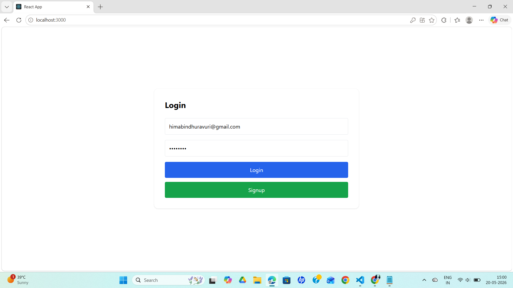
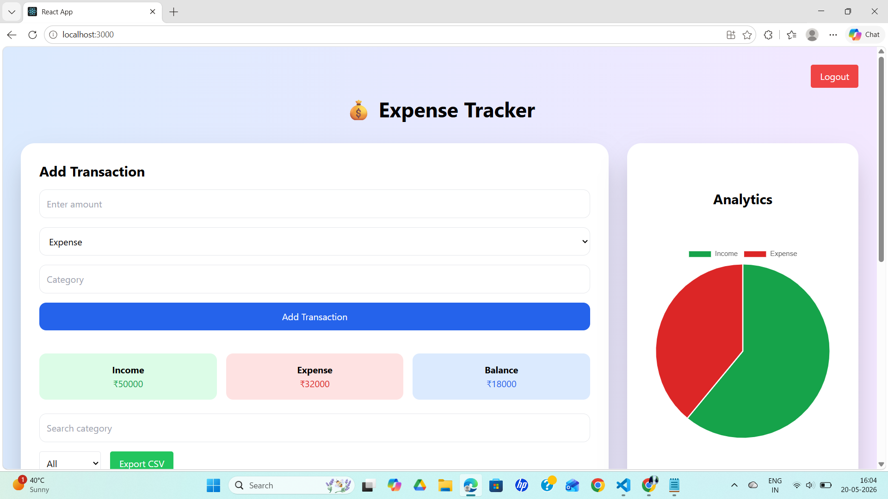
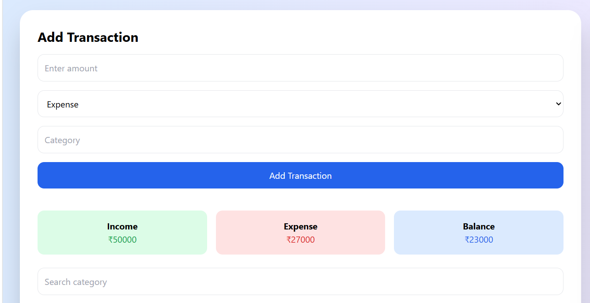
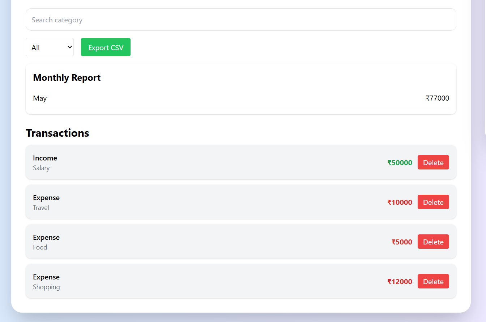
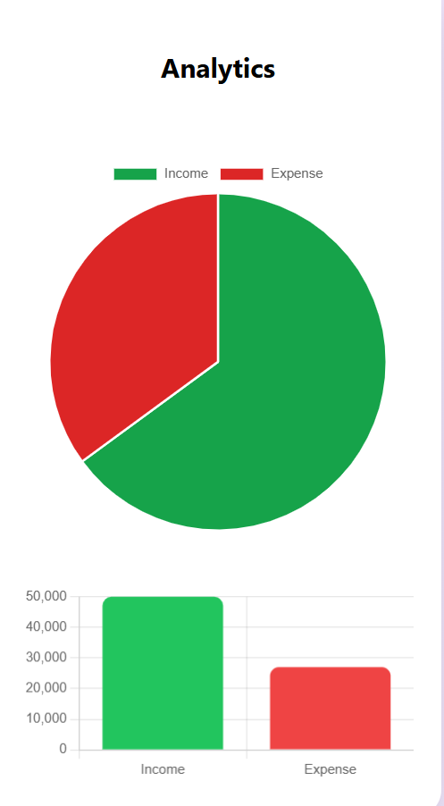
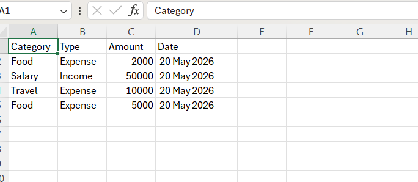

# 💰 Expense Tracker App

A modern Expense Tracker web application built using **React.js**, **Firebase**, and **Chart.js**.  
It helps users track income, expenses, and view financial insights with visual analytics.

---

## 📌 Features

- 🔐 User Authentication (Login/Signup)
- 💸 Add Income & Expense transactions
- 📊 Real-time balance calculation
- 📅 Monthly reports and insights
- 🧾 Category-wise expense tracking
- 📈 Interactive Pie Chart using Chart.js
- 🗂️ Transaction history view
- ✏️ Edit and Delete transactions
- ☁️ Cloud storage using Firebase Firestore
- 📱 Fully responsive UI (Mobile + Desktop)
- 📤 Export transactions as CSV file

---

## 🛠️ Tech Stack

- **Frontend:** React.js, Tailwind CSS
- **Backend:** Firebase
- **Database:** Firestore
- **Charts:** Chart.js / react-chartjs-2
- **Authentication:** Firebase Auth
- **Deployment:** Vercel / Netlify

---

## 🖼️ Screenshots

### Login Page

### Dashboard

### Add Transaction

### Transaction History

### Chart

### CSV Export

## 📊 Key Highlights

- Automatically calculates total balance, income, and expenses
- Visual representation of spending using charts
- Organized transaction history for better financial control
- Secure and scalable cloud-based architecture

---

## 🎯 Future Enhancements

- Budget planning and alerts  
- Monthly financial reports   
- Dark mode support  
- AI-based spending insights  

---

## 📜 License

This project is open-source and available for personal and educational use.

---

## 👩‍💻 Author

** Ravuri Himabindhu**  
B.Tech CSE Student | React & Firebase Developer

